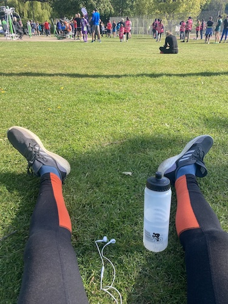
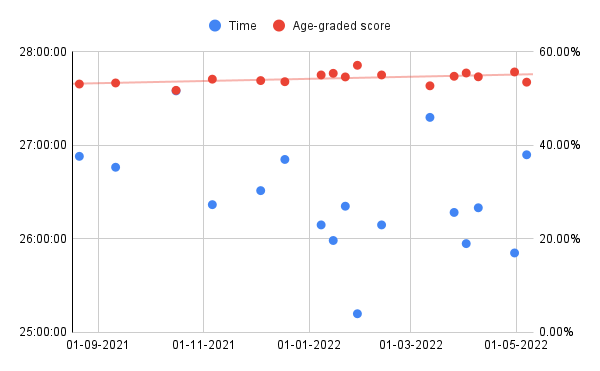

# The 'Athletic' Performance of the Middle-Aged Male

Stephen Cornelius
Springer Nature, London
stephen.cornelius@springer.com

## Abstract

We studied the performance of a fortysomething man of limited atletic potential in weekly 5km 'parkrun'. Although the subject reported that he enjoyed the events, we found little evidence of sustained improvement in finishing time or age-graded performance. Further studies as to the effect of alcohol, diet and injuries are required.

## Introduction

Parkruns are free, weekly, community events all around the world. The runs are 5km long and take place on a Saturday morning in parks and open spaces [1]. Parkruns have been shown to have a postive impact on participants' health and wellbeing, especially for male runners over 45 years of age.[2]

## Method

The subject of the study began participating in his local parkrun in the autumn of 2021, shortly after the events resumed following the covid-19 pandemic. Runners sign up and receive a personalised bar code to print out. When they cross the line they are given a token with a different bar code. The two are scanned by a volunteer using a mobile device, and the finishing time of the runner is recorded on the parkrun website. The time is converted into a WMA age-grade score[3] based on the age and sex of the runner. The data from the subject's first 17 runs at his local event were downloaded from the website and studied. 

## Results

The times and age-graded scores of the runner are given in [run-results.csv](/data/run-results.csv).

## Discussion

Although a small upward trend in age-graded score over the study period is discernable, the subject's finishing times remain highly variable. The greatest period of improvement came after managing to do the run every week in January, the slowest time followed a period of injury in the early spring. The subject reports suffering from a persistent muscle injury in his right leg, but further data is needed to separate the impact of that from the impact of intermittent participation, hangovers, and generally not always feeling up to it.

## Bibliography

1. [https://www.parkrun.org.uk](https://www.parkrun.org.uk)

2. Grunseit, A., Richards, J. & Merom, D. Running on a high: parkrun and personal well-being. BMC Public Health **18**, 59 (2018). [https://doi.org/10.1186/s12889-017-4620-1](https://doi.org/10.1186/s12889-017-4620-1)

3. [https://support.parkrun.com/hc/en-us/articles/200565263-What-is-age-grading-](https://support.parkrun.com/hc/en-us/articles/200565263-What-is-age-grading-)

